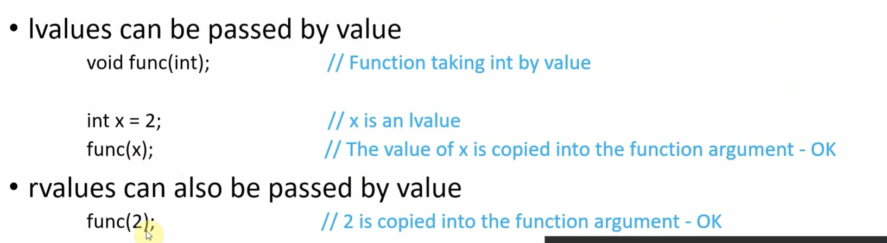
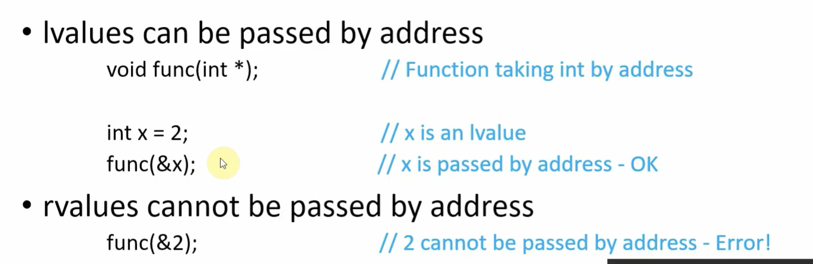

https://www.educative.io/answers/what-are-move-semantics-and-copy-semantics-in-cpp11

* Move semantic được dùng để đưa resource của một object này sang object khác (đưa vào function chẳng hạn)
mà không cần phải copy (bởi vì copy vô cùng tốn hiệu năng).
Thường được dùng khi object được đưa vào function hoặc function trả về object

* Các phiên bản trước của C++11 thì đưa data từ object này sang object khác, ta thường dùng pointer hoặc reference. Nhưng ở C++11 trở lên thì khái niệm move semantic được sinh ra để giảm chi phí copy object.

* Nếu object là rvalue thì data có thể move đến target thay vì copy

# Hiểu Khái niệm lvalue - rvalue

Một đối tượng trong C++ có thể là lvalue hoặc rvalue
* Thông thường lvalue là bên trái dấu bằng
* rvalue là bên phải dấu bằng

## lvalue
* Phải có tên 
* Có thể lấy đươc địa chỉ thông qua toán tử &
* x có thể lvalue

## rvalue
còn lại là rvalue :>
ví dụ: 2 là rvalue, func() là rvalue

## lvalue và rvalue có behave khác nhau khi làm đối số function

### Pass by value

### Pass by address

### Pass by const ref for rvalue

## Trong C++11 cho phép move nếu như đối số là rvalue

### Pass by move

## lvalue reference

## rvalue reference

Vì thế dựa vào pass by move, chúng ta còn có thể overload dựa vào pass bằng rvaule hay lvalue.
Và ứng dụng thực tế nhất là overload copy contrutor và move contructer. Lúc này thay vì copy data khi pass vào function thì nó move data và sẽ improve performance hơn

# std::move
nếu như muốn pass lvalue vào function sử dụng rvalue thì casting bằng std::move 

# C++11 có move contructer và move operator

